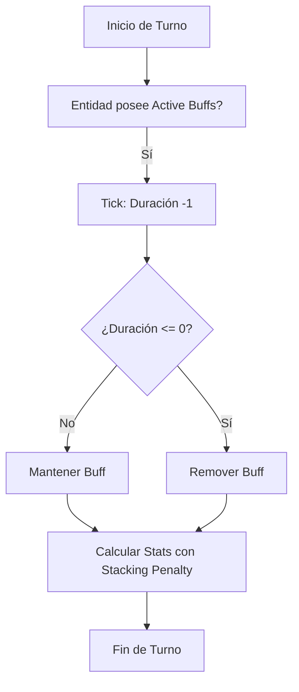

# `BuffManager.py`

## Índice
1. [Descripción General](#descripción-general)
2. [Dependencias e Inyecciones](#dependencias)
3. [Constantes y Variables Globales](#constantes)
4. [Clases y Estructuras de Datos](#clases)
5. [Funciones del Módulo (API)](#funciones)

---

## 1. Descripción General
El `BuffManager.py` gestiona el estado temporal (buffs y debuffs) de las entidades del juego. Es responsable de aplicar bonificaciones o penalizaciones a las estadísticas, calcular su tiempo de expiración por cada "tick" (turno) y aplicar mecánicas avanzadas como los *Diminishing Returns* (Rendimientos Decrecientes) cuando múltiples efectos intentan modificar la misma estadística simultáneamente.

---

## 2. Dependencias e Inyecciones
- **Archivos Base**: Requiere el JSON `./Data/DataBuffs.json` para definir la librería de buffs/debuffs del juego.
- **Bibliotecas Standard**: `json`, `os`, `copy.deepcopy` para clonar instancias base de buffs.

---

## 3. Constantes y Variables Globales
- `_buff_manager_instance` (`BuffManager` | `None`): Singleton global.

---

## 4. Clases y Estructuras de Datos

### `Buff`
Representa una instancia activa de un buff o debuff aplicado a una entidad.

#### Atributos de Instancia
- `self.buff_id` (`str`): Identificador único (ej: `"1_buff"`, `"5_debuff"`).
- `self.name` (`str`), `self.description` (`str`), `self.icon` (`str`): Metadatos visuales.
- `self.duration_base` (`int`): Turnos que dura por defecto.
- `self.duration_current` (`int`): Turnos restantes antes de expirar (9999 si es permanente).
- `self.type` (`str`): Tipo de buff (ej. `"flat"`, `"percentage"`).
- `self.effects` (`Dict[str, float]`): Diccionario con las estadísticas afectadas y sus valores (ej. `{"attack": 10.0}`).
- `self.source` (`str`): Origen (`"skill"`, `"item"`, `"potion"`).
- `self.permanent` (`bool`): Si es True, no decae con los turnos. Útil para equipo.
- `self.buff_after_unequip` (`int`): Turnos que dura un buff de equipo *después* de desequiparlo.
- `self.is_debuff` (`bool`): True si el ID contiene `"_debuff"`.
- `self.applied` (`bool`): Bandera para saber si ya se sumaron sus estadísticas a la entidad.
- `self.stack_penalty` (`float`): Multiplicador de penalización por acumular muchos buffs del mismo tipo (de 0.0 a 1.0).

#### Métodos Principales
- `tick(self) -> bool`
  - **Propósito**: Resta 1 a `duration_current` si no es permanente. Devuelve `True` si sigue vivo o `False` si expiró.
- `get_display_name(self) -> str`
  - **Propósito**: Devuelve un string formateado para la UI: `[Icono] [Nombre] ([Turnos]T) [[Penalización]% si aplica]`.
- `copy(self) -> Buff`
  - **Propósito**: Utiliza `deepcopy` para clonar un buff (útil para aplicarlo a un jugador sin modificar la base de datos central).

### `BuffManager`
Motor central de estados.

#### Constantes de Clase
- `STACK_PENALTIES` (`Dict[int, float]`): Define los rendimientos decrecientes. El 1er buff aplica al 100%, el 2do al 75%, el 3ro al 35%, el 4to al 9% y a partir del 5to solo el 3%.

#### Atributos de Instancia
- `self.buffs_json_path` (`str`): Ruta del archivo (`"./Data/DataBuffs.json"`).
- `self.buffs_data` (`Dict`): Base de datos en memoria de los Buffs.
- `self.debuffs_data` (`Dict`): Base de datos en memoria de los Debuffs.

#### Métodos Principales
- `load_buffs(self) -> bool`
  - **Propósito**: Lee el JSON y separa los datos en `self.buffs_data` y `self.debuffs_data`.
- `create_buff(self, buff_id: str, source: str = "skill", permanent: bool = False, buff_after_unequip: int = 0) -> Optional[Buff]`
  - **Propósito**: Instancia un objeto `Buff` buscando su data por ID.
- `apply_buffs_to_entity(self, entity, active_buffs: List[Buff]) -> Dict[str, float]`
  - **Propósito**: Calcula las matemáticas detrás de todos los buffs en `active_buffs`. Aplica las penalizaciones de *Stacking* de ser necesario y devuelve el valor total consolidado de modificaciones a aplicar a la entidad.
  - **Retornos**: Un diccionario con la suma neta de los efectos por cada stat.
- `_group_buffs_by_stat(self, buffs: List[Buff]) -> Dict[str, List[Buff]]`
  - **Propósito**: Organiza los buffs activos según qué estadística modifican para preparar el terreno para las penalizaciones.
- `_apply_stacking_penalties(self, effects_by_stat: Dict[str, List[Buff]], all_buffs: List[Buff])`
  - **Propósito**: Ordena los buffs que afectan un mismo stat de mayor impacto a menor impacto, aplicando el multiplicador dictado por `STACK_PENALTIES` según su posición en la lista.
- `remove_buffs_from_entity(self, entity, buffs_to_remove: List[Buff]) -> Dict[str, float]`
  - **Propósito**: Calcula cuánto valor (con penalización aplicada) debe removerse cuando expira un buff para que los stats vuelvan a la normalidad sin arrastrar errores de coma flotante.

---

## 5. Funciones del Módulo (API)
- `get_buff_manager(buffs_path: str = "./Data/DataBuffs.json") -> BuffManager`
  - **Propósito**: Devuelve la instancia Singleton del Manager, inicializándolo si es la primera llamada.

---

## Ciclo de Vida de los Efectos



---

## Integración con el Jugador

El sistema se integra a través de la propiedad `player.active_buffs`. Los efectos se pueden originar de tres fuentes principales:
- **Habilidades (`skill`)**: Temporales, activadas en combate.
- **Pociones (`potion`)**: Temporales, activadas desde el inventario.
- **Objetos (`item`)**: Permanentes mientras el ítem esté equipado.

---

## Ejemplos de Uso

### Aplicar un buff de "Fuerza" al jugador

```python
from Modules.ModulesManager.BuffManager import apply_buff_to_player

# "1_buff" es un ID definido en DataBuffs.json
apply_buff_to_player(player, "1_buff", source="potion")
```

### Procesar el paso del tiempo en combate

```python
from Modules.ModulesManager.BuffManager import process_turn_buffs

# Llamar al final de cada turno de combate
process_turn_buffs(player)
```
---

## Notas Técnicas

- Los buffs se guardan en el archivo de guardado como parte del objeto `player`.
- Los iconos (✨, 🛡️, ⚠️) se renderizan automáticamente en la UI de combate.
