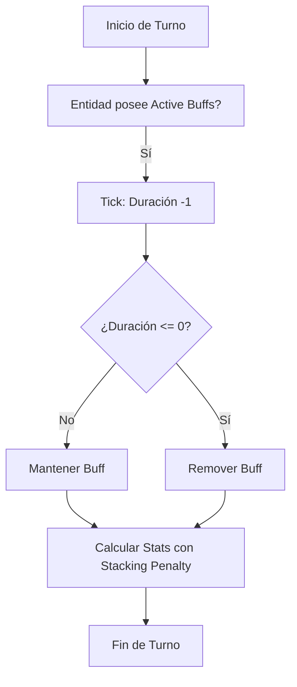

# `BuffManager.py`

## Índice

1. [Descripción General](#descripción-general)
2. [Clase `Buff`](#clase-buff)
3. [Gestor: `BuffManager`](#gestor-buffmanager)
4. [Mecánica de Stacking (Diminishing Returns)](#mecánica-de-stacking-diminishing-returns)
5. [Ciclo de Vida de los Efectos](#ciclo-de-vida-de-los-efectos)
6. [Integración con el Jugador](#integración-con-el-jugador)
7. [Ejemplos de Uso](#ejemplos-de-uso)

---

## Descripción General

`BuffManager.py` gestiona los estados alterados (buffs y debuffs) aplicados tanto al jugador como a los enemigos. Permite definir efectos temporales o permanentes que alteran estadísticas como daño, defensa, regeneración de salud, entre otros.

---

## Clase `Buff`

Representa una instancia individual de un efecto de estado.
- `buff_id`: Identificador único (terminado en `_buff` o `_debuff`).
- `duration_current`: Turnos restantes antes de que el efecto desaparezca.
- `permanent`: Indica si el efecto no tiene límite de tiempo (ej. bonus de equipo).
- `effects`: Diccionario de modificadores aplicados.

---

## Gestor: `BuffManager`

Carga las definiciones desde `DataBuffs.json` y maneja la lógica de aplicación masiva.

### Funciones Principales
- `create_buff()`: Instancia un efecto basado en su ID.
- `apply_buffs_to_entity()`: Calcula los modificadores totales de una lista de buffs, aplicando penalizaciones si es necesario.
- `tick_buffs()`: Reduce la duración de todos los efectos activos en 1 turno.

---

## Mecánica de Stacking (Diminishing Returns)

Para evitar que el jugador se vuelva invencible acumulando múltiples buffs del mismo tipo, el sistema implementa **rendimientos decrecientes**:
- Si tienes 2 o más buffs que afectan al **mismo atributo** (ej. dos buffs de daño):
    1. El buff más potente se aplica al **100%**.
    2. El segundo se aplica al **75%**.
    3. El tercero al **35%**.
    4. El cuarto al **9%**.
    5. El quinto en adelante al **3%**.

Esto obliga al jugador a buscar diversidad en sus buffs en lugar de acumular el mismo efecto repetidamente.

---

## Ciclo de Vida de los Efectos



---

## Integración con el Jugador

El sistema se integra a través de la propiedad `player.active_buffs`. Los efectos se pueden originar de tres fuentes principales:
- **Habilidades (`skill`)**: Temporales, activadas en combate.
- **Pociones (`potion`)**: Temporales, activadas desde el inventario.
- **Objetos (`item`)**: Permanentes mientras el ítem esté equipado.

---

## Ejemplos de Uso

### Aplicar un buff de "Fuerza" al jugador

```python
from Modules.ModulesManager.BuffManager import apply_buff_to_player

# "1_buff" es un ID definido en DataBuffs.json
apply_buff_to_player(player, "1_buff", source="potion")
```

### Procesar el paso del tiempo en combate

```python
from Modules.ModulesManager.BuffManager import process_turn_buffs

# Llamar al final de cada turno de combate
process_turn_buffs(player)
```
---

## Notas Técnicas

- Los buffs se guardan en el archivo de guardado como parte del objeto `player`.
- Los iconos (✨, 🛡️, ⚠️) se renderizan automáticamente en la UI de combate.
